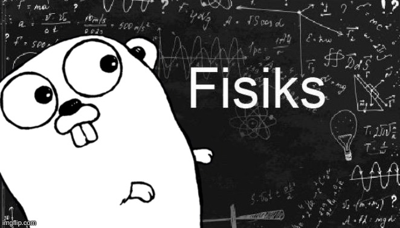

<div align="center">
    
    <h3>A fairly simple physics engine, written in Go</h3>
</div>

- [🌈 How it works](#-how-it-works)
- [💻 Development](#-development)
    - [Project setup](#project-setup)
- [📜 Credits](#-credits)
- [🔐 License](#-license)

## 🌈 How it works


## 💻 Development

Make sure you have [Git](https://git-scm.com/) installed on your computer and [Go](https://go.dev) to the latest version.

### Project setup

Download the project locally from GitHub :

```bash
git clone https://github.com/theovidal/fisiks.git  # HTTP
git clone git@github.com:theovidal/fisiks          # SSH
```

## 📜 Credits

- Main library: [ebiten](https://github.com/hajimehoshi/ebiten)
- Maintainer: [Théo Vidal](https://github.com/theovidal)

## 🔐 License

Do What The Fuck You Want.
